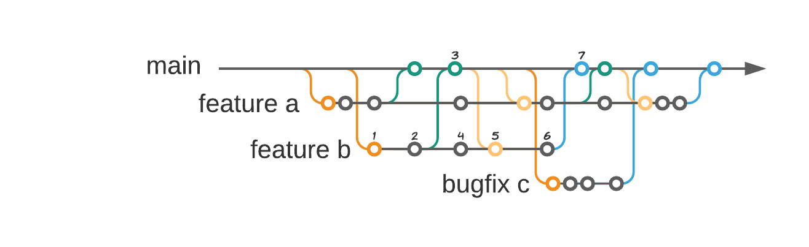

<h1 align="center">
  <a title="Building financial tools for Canada's entrepreneurs" href="https://pillar.financial">
    
     
  </a>
  Git workflow
</h1>

## At a glance

At Pillar, we've adopted the Continous Integration practice but using a safe approach of branching and merging back to main instead of committing directly.

This combination of strategies increases the number of integration to the main branch as often as possible but still supports the practice of peer-review and security checks
before accepting the changes in the main branch.

The main point is to avoid long-lived branches reducing the number of integration conflicts and introduce small changes in the codebase.

Martin Fowler's introduction on CI

> Continuous Integration is a software development practice where members of a
> team integrate their work frequently, usually each person integrates at least daily - leading
> to multiple integrations per day. Each integration is verified by an automated build (including test)
> to detect integration errors as quickly as possible.
> Many teams find that this approach leads to significantly reduced integration problems and allows a
> team to develop cohesive software more rapidly. 

## Development

A developer when starting to write a new feature or a bug fix needs to branch out from the main branch (conveniently named main) and commit to
this branched version (See [naming conventions](https://github.com/getPillar/developer-values/blob/master/code/NAMING_STANDARDS.md#rules) for help on how to name a branch).

During the development process, it is the developer's responsibility to request as often as possible pull requests back to the main branch, integrating the changes when it is
deemed stable and do not introduce regressions in the main code-base.

Also during the development process, the developer is responsible to rebase his/her feature branch against the main branch to not lose track of the most recent changes and always
evaluate his/her changes against the most updated version.

When the feature is considered complete and fully integrated, it's also the developer's responsibility to certify that all branches created are cleaned/removed from the
main repository, as to keep it tidy and without stale code.

Please review the scenarios described below covering common situations and the steps in the process.

### Scenario 1 - Taylor writing complex feature A

1. checkout branch feat/feature-a from main.
2. commit a new module, some business logic and unit tests for it.
3. commit code refactor for the new module and optimizations.
4. open a new pull request from feat/feature-a to main.
5. commit new unit tests supporting new business logic.
6. rebase feat/feature-a with the latest from main (fetching new code introduced by feat/feature-b integration).
7. commit more functionality and unit tests.
8. open a new pull request from feat/feature-a to main.
9. commit more changes and corrections into feature-a logic.
10. rebase feat/feature-a with the latest from main (fetching more code introduced by feat/feature-b integration).
11. integrate the newly developed modules in the main API logic, making the changes now available to be consumed by others.
12. optimize overall logic and increase test coverage.
13. open the final pull request from feat/feature-a to main closing the life-cycle of the feature-a development.

### Scenario 2 - Reese writing short feature B

placeholder -- describe short development of feature B.

### Scenario 3 - Alex bug fixing C

placeholder -- describe bug fixing process of C.

## Releases

placeholder -- describe CI/CD process of github action building containers and making it available to deploy at staging environment.

## Hotfixes

Using the CI process, a hotfix is no longer necessary since the latest container built from main branch is considered stable and
viable to be tested/deployed.

In case of fix of no longer up-to-date release is required, please consider approaching the problem as a versioned microservice release,
creating a new service sourced from said release and maintain it as such. (placeholder - add a link to microservice architecture).

## Supporting Documentation

- [Martin Fowler's Continuous Integration](https://martinfowler.com/articles/continuousIntegration.html)
- [Dave Farley's Continous Integration](https://www.youtube.com/watch?v=jAtI5T4O1j0)
