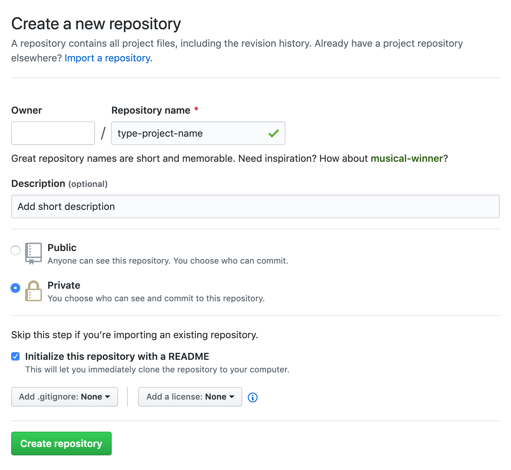
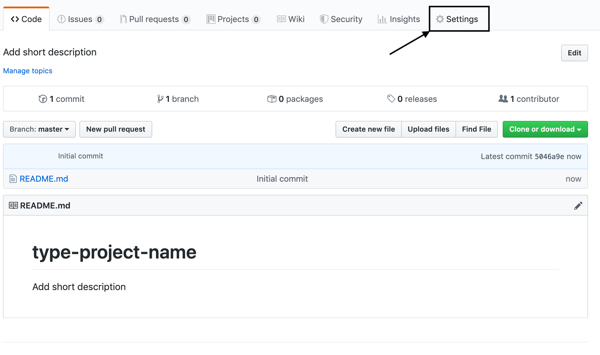
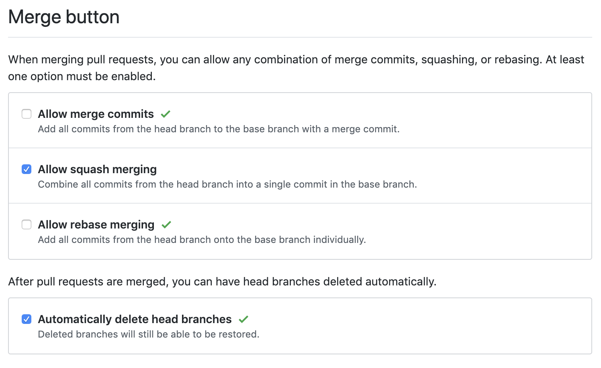
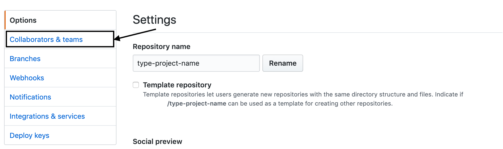
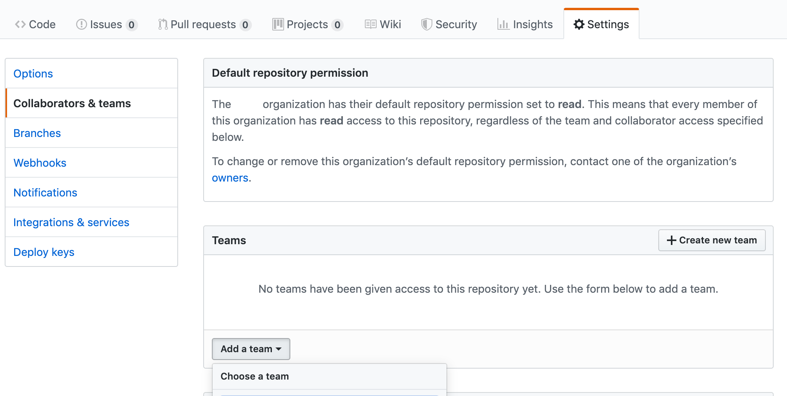
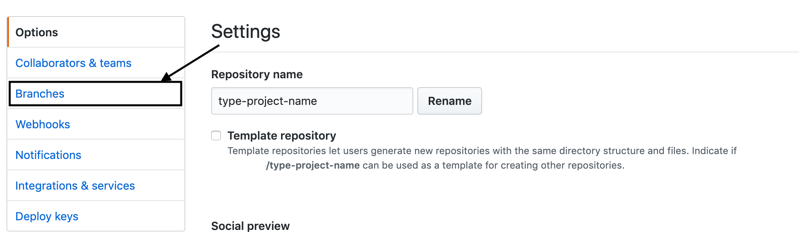
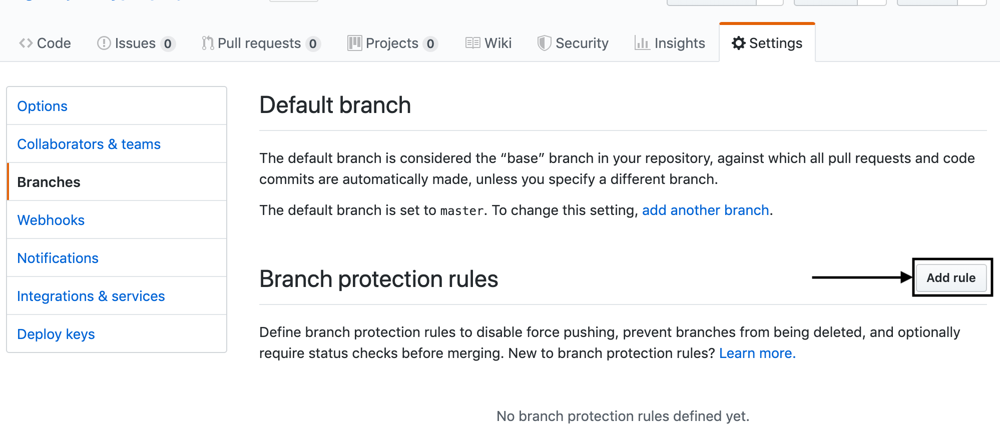
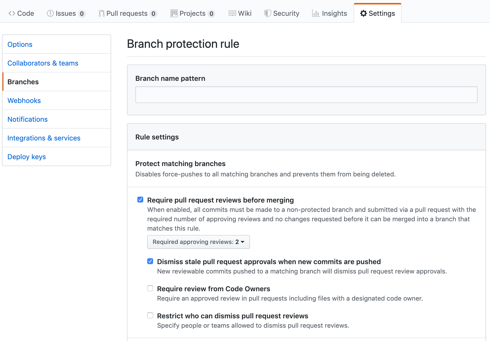

<h1 align="center">
  <a title="Building financial tools for Canada's entrepreneurs" href="https://pillar.financial">
    
     
  </a>
  New git repository
</h1>

## Create repository

> To create a new project, go on the main page and select `new`.  
> After you just need to fill information about the project (`Repository name`, `Description`).  
> Then put the project to `Private` with `Initialize README` checked.  
> Click on the CTA `Create repository`.  

## Configure the project repository

> Click on the CTA `Settings`.

### Allow only squash merging

> You need to scroll to `Merge button`.  
> Un-check `Allow merge commits` and `Allow rebase merging`.  

### Add team rights

> Here will add a team for this repository.  
> In the menu click on the CTA `Collaborators & teams`.  
> Click on the CTA `Add the team` and select once (by default select `PillarDevs`).

### Branch control

> Here will add rules for control branch.  
> Click on the CTA `Add rule`.  
> Now check `Require pull request reviews before merging` and select `Required approving reviews` for `2 reviewers`.  
> Then to finish you can check `Dismiss stale pull request approvals when new commits are pushed`.

